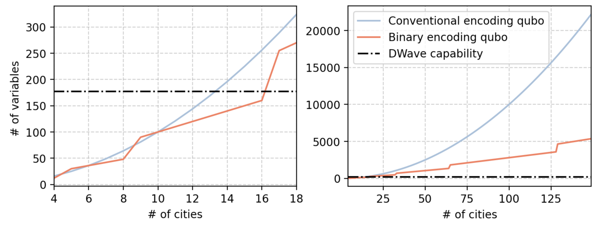
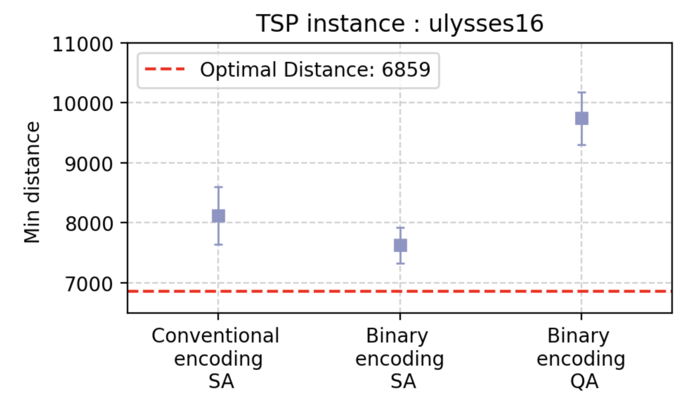

# QHack 2024 The Sound of Silence Challenge 
<!-- ###  Building a phase identification classifier of the quantum many-body system.  -->

### BeQUBO: Binary Encoding of Quadratic Unconstrained Binary Optimization for Travelling Salesman Problem

## Bohr's Cat
Member : Nexus Hashimoto

## Project description 

In this hackathon project, we introduced a binary encoding scheme that leads to a novel QUBO formulation for the TSP. Our method significantly reduces the required number of qubits, which is given by the equation:  
$$n_{be} = N \lceil \log_2 N \rceil + N \frac{1}{2} \lceil \log_2 N \rceil (\lceil \log_2 N \rceil - 1)$$  
To illustrate the effectiveness of this reduction, we compare $N^2$ and $n_{be}$ in figure below.

Required number of variables for conventional encoding QUBO and Binary encoding QUBO proposed in this QHack project. The maximum capacity of D-Wave quantum annealer for fully connected problem $=177$ is shown.

The results of the TSP on the Ulysses16 instance reveal that the conventional encoding necessitates  $16^2 = 256$ variables, in stark contrast to our binary encoding approach, which requires only 160 variables. Here, "SA" denotes simulated annealing performed on a classical computer, whereas "QA" refers to quantum annealing carried out on the D-Wave quantum annealer. It's important to note that the maximum number of binary variables that D-Wave can support for a fully connected instance is 177.

In this repository, we offer the source code necessary for implementing the innovative binary encoding scheme for the TSP QUBO. Initially, the notebook titled `tsp_binary_encoding_formulation_ALM_run1.ipynb` details the binary encoding scheme and demonstrates its execution via simulated annealing. Following this, `tsp_normal_formulation_ALM_run1.ipynb` provides an overview of the conventional encoding scheme, also showcasing its application through simulated annealing. Finally, `DWave_tsp_binary_encoding_formulation_ALM_run1.ipynb` presents the binary encoding scheme as executed on the D-Wave quantum annealer, offering insights into its practical application within a quantum computing context.
